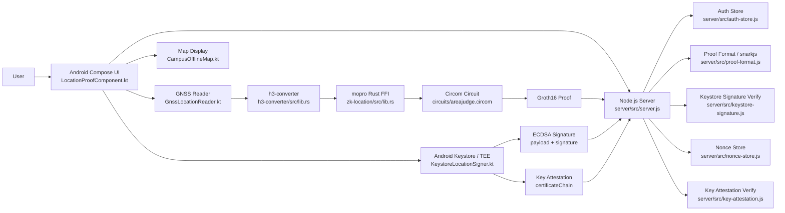
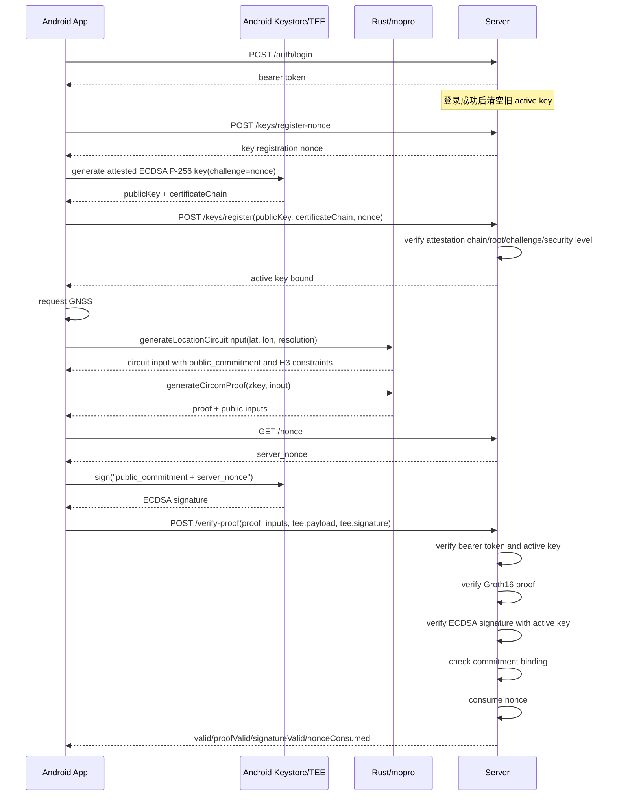

# ZK-Location 架构总览

更新时间：2026-05-16

本文档用于先建立全局心智模型，再去读具体代码。它不替代 `docs/protocol.md`，而是解释一次完整操作从 Android 点击按钮到服务端返回 `valid=true` 的数据流。

## 1. 一句话架构

```text
Android UI
-> GNSS
-> Rust h3-converter
-> Circom/mopro proof
-> Android Keystore/TEE ECDSA signature
-> Node.js server verifier
```

系统目标是：客户端证明自己在目标 H3 cell 内，但服务端不接收明文经纬度。服务端只验证 ZK proof、Keystore 签名、nonce 和 key attestation。

## 2. 组件图



## 3. 主链路时序



## 4. 数据分类

| 数据 | 生成位置 | 是否发给服务端 | 作用 |
|---|---|---:|---|
| GNSS `lat/lon` | Android `GnssLocationReader.kt` | 否 | 明文位置，只在客户端本地使用 |
| `x` | `h3-converter/src/lib.rs` | 否 | 经度转全局非负整数，电路私有输入 |
| `y` | `h3-converter/src/lib.rs` | 否 | 纬度转全局非负整数，电路私有输入 |
| `salt` | `h3-converter/src/lib.rs` | 否 | commitment 随机盲化值，电路私有输入 |
| `public_commitment` | Rust Poseidon | 是 | 绑定 proof 和 Keystore 签名 |
| H3 半平面系数 | Rust H3 预处理 | 是 | 服务端可见的目标区域公开约束 |
| ZK proof | Android/mopro | 是 | 证明私有坐标满足 commitment 和 H3 约束 |
| `publicKey` | Android Keystore | 只在 key 绑定阶段 | 服务端绑定到当前用户 |
| `certificateChain` | Android Keystore | 只在 key 绑定阶段 | 服务端验证 key 来自可信硬件环境 |
| `tee.payload` | Android 客户端 | 是 | 被 Keystore 签名的规范化文本 |
| `tee.signature` | Android Keystore | 是 | 服务端用 active key 验证 |
| `server_nonce` | 服务端 | 是 | 防重放，签名验证通过后才消费 |

## 5. 两个 nonce 不要混淆

| nonce | 接口 | 用途 | 消费位置 |
|---|---|---|---|
| key registration nonce | `POST /keys/register-nonce` | 写入 Android Key Attestation challenge，证明本次 key 是为当前绑定请求生成 | `/keys/register` 成功时消费 |
| proof server nonce | `GET/POST /nonce` | 写入 Keystore 签名 payload，防止 proof/signature 重放 | `/verify-proof` 中 proof 和签名都通过后消费 |

## 6. 关键安全边界

- 服务端不信任客户端上传的未知 attestation root。
- Huawei/OEM root 必须人工确认后加入 `server/trust/local_android_attestation_roots.pem`。
- 登录成功后服务端会清空旧 active key，客户端必须重新执行 `Generate new key and bind`。
- `/verify-proof` 不再上传 `certificateChain`，服务端使用当前登录用户的 active key 验签。
- proof 请求里即使带了攻击者 `publicKey`，服务端也应该忽略并使用 active key。
- nonce 只在 proof 和签名都通过后消费，避免攻击者用坏请求消耗合法 nonce。

## 7. 每个核心文件负责什么

| 文件 | 职责 |
|---|---|
| `zk-location/android/app/src/main/java/com/example/moproapp/LocationProofComponent.kt` | Android 主流程和 UI 状态编排 |
| `zk-location/android/app/src/main/java/com/example/moproapp/KeystoreLocationSigner.kt` | Keystore key 生成、attestation chain 导出、payload 签名 |
| `zk-location/android/app/src/main/java/com/example/moproapp/GnssLocationReader.kt` | 单次 GNSS 定位 |
| `h3-converter/src/lib.rs` | 坐标转换、H3 边界、半平面系数、Poseidon commitment |
| `zk-location/src/lib.rs` | Rust/mopro FFI 导出入口 |
| `zk-location/src/circom.rs` | mopro Circom proof 生成和验证封装 |
| `circuits/areajudge.circom` | ZK 电路约束 |
| `server/src/server.js` | HTTP 路由和最终验证编排 |
| `server/src/auth-store.js` | 用户、session、key 绑定、key nonce |
| `server/src/key-attestation.js` | Android Key Attestation 验证 |
| `server/src/keystore-signature.js` | payload 解析、ECDSA 验签、commitment 绑定 |
| `server/src/nonce-store.js` | proof nonce 防重放 |
| `server/test/verify-proof-attacks.test.js` | 主攻击/失败用例 |

